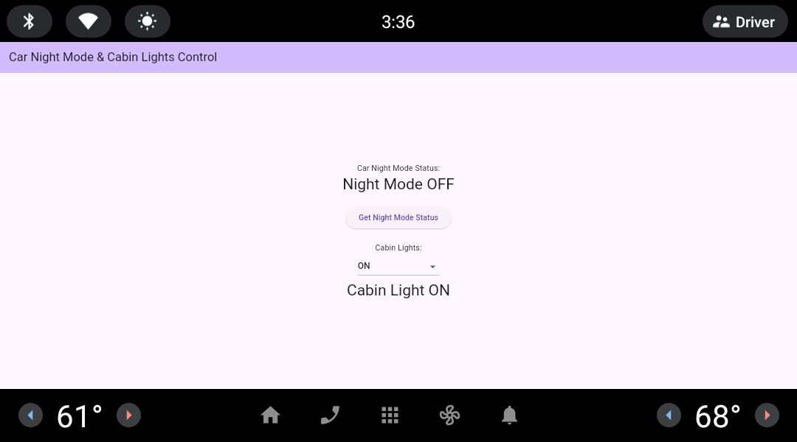

# Flutter AAOS CarPropertyManager Sample

This project is an experimental Flutter application that demonstrates how to use the `CarPropertyManager` from Android Automotive OS (AAOS). The application provides a simple interface to control and monitor car properties such as Night Mode and Cabin Lights.



## Features

- **Night Mode Status**: Get and display the current Night Mode status of the car.
- **Cabin Lights Control**: Control the car's cabin lights (ON, OFF, Daytime Running, and Automatic modes).

## Prerequisites

- **Flutter SDK**: Ensure Flutter is installed and set up on your machine. Follow the [official guide](https://flutter.dev/docs/get-started/install) if you haven't installed it yet.
- **Android Studio** or **Visual Studio Code**: Any IDE that supports Flutter development.
- **Android Automotive OS (AAOS) Emulator**: The project utilizes Android's `CarPropertyManager`, which is specific to Automotive OS. Set up an AAOS emulator as described in the [official documentation](https://developer.android.com/training/cars/testing).
- **Special Privileges**: To run the app with system-level privileges, additional steps are required.

## Getting Started

1. **Clone the repository**:

   ```bash
   git clone https://github.com/haradama/flutter_aaos_car_property_example.git
   cd flutter_aaos_car_property_example
   ```

2. **Install dependencies**:

   ```bash
   flutter pub get
   ```

3. **Set up the AAOS emulator** (if not already set up).

4. **Grant system-level privileges**: Follow the instructions below to run the app with special privileges in the AAOS emulator.

### Running the App with System-Level Privileges

To run this sample app on the Android Automotive OS emulator with system-level permissions, follow these steps:

1. **List available Android Virtual Devices (AVDs)**:

   ```bash
   emulator -list-avds
   ```

2. **Start the AVD in writable system mode and disable SELinux**:

   ```bash
   emulator -avd your_avd_name -writable-system -selinux permissive
   ```

3. **Switch to root and disable verity**:

   ```bash
   adb root
   adb disable-verity
   adb reboot
   ```

4. **Remount the system and create the necessary directory**:

   ```bash
   adb root
   adb remount
   adb shell mkdir /system/priv-app/flutter_aaos_car_property_example
   adb shell chmod 755 /system/priv-app/flutter_aaos_car_property_example
   ```

5. **Build the release APK**:

   ```bash
   flutter build apk --release
   ```

   After the build completes, the APK will be located at `build/app/outputs/flutter-apk/app-release.apk`.

6. **Push the APK to the emulator's system directory**:

   ```bash
   adb push build/app/outputs/flutter-apk/app-release.apk /system/priv-app/flutter_aaos_car_property_example/
   adb shell chmod 644 /system/priv-app/flutter_aaos_car_property_example/app-release.apk
   ```

7. **Modify the system's permission file**:

   Pull the existing `privapp-permissions-platform.xml` file:

   ```bash
   adb pull /system/etc/permissions/privapp-permissions-platform.xml
   ```

8. **Edit the permission file**:

   Add the following block to grant the app the necessary car control permissions:

   ```xml
   <privapp-permissions package="dev.haradama.flutter_aaos_car_property_example">
       <permission name="android.car.permission.CONTROL_CAR_DOORS"/>
   </privapp-permissions>
   ```

9. **Push the modified permission file back to the emulator**:

   ```bash
   adb push privapp-permissions-platform.xml /system/etc/permissions/
   ```

10. **Reboot the emulator**:

```bash
adb shell reboot
```

11. **Run the app**: After rebooting, the app should now have the required system-level privileges.

## Android Configuration

The project requires the use of specific Android libraries and permissions to interact with car properties. The following changes were made to the Android configuration:

### `build.gradle`

In `android/app/build.gradle`, the `android.car` library was added:

```gradle
android {
    ...
    useLibrary("android.car")
}
```

### Permissions in `AndroidManifest.xml`

The following permissions are required to control car interior lights and access environmental information:

```xml
<uses-permission android:name="android.car.permission.CAR_EXTERIOR_ENVIRONMENT" />
<uses-permission android:name="android.car.permission.CONTROL_CAR_INTERIOR_LIGHTS" />
```

These were added to `android/app/src/main/AndroidManifest.xml`.

## CarPropertyManager Integration

The integration with Android's `CarPropertyManager` is implemented in Kotlin (for the Android side) and Dart (for Flutter). The app communicates with Android's `CarPropertyManager` using a MethodChannel.

### Kotlin (Android-side)

The Kotlin code initializes the `CarPropertyManager` and handles interactions to get and set car properties.

### Dart (Flutter-side)

The Flutter app uses the `CarService` class to communicate with the native Android methods.

## Sequence Diagram

The following sequence diagram shows the interaction between the app, `CarService`, `MethodChannel`, `MainActivity`, and the Android Automotive `CarPropertyManager`:


